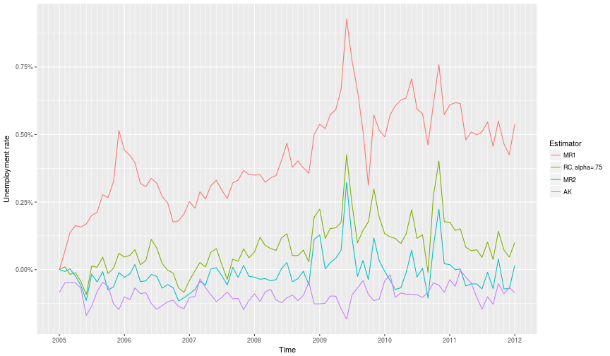

# Multivariate Composite Estimation with An Application to the U.S. Labor Force Statistics 
`pubBonneryChengLahiri2016` is an R package that contains the source code to reproduce the graphs and simulations of different documents, including
* ["Multivariate Composite Estimation with An Application to the
U.S. Labor Force Statistics"]() by Bonnery, Cheng and Lahiri (see Section 2 and 3. below).

## 1. How to install the package

```r
devtools::install_github("DanielBonnery/pubBonneryLahiriCheng2016")
```

Note that this package depends on different packages I developped, that will be installed automatically, including:
* [CompositeRegressionEstimation](https://github.com/DanielBonnery/CompositeRegressionEstimation). CompositeRegressionEstimation is a package that contains generic functions to compute composite regression estimators, AK estimators, Empirical best linear estimators.
* [dataCPS](https://github.com/DanielBonnery/dataCPS). dataCPS is a package that contains tools to download the public use data files related to CPS from the Census Bureau website and convert them to R data frames.


## 2. Reproduction of the computations made on CPS data. 

### 2.1. Note on the data 
Here we give the programs we used to compute the estimates on the Census data, and we apply those programs to the CPS data that is published on the web by the Census. Differences between web data and data we had access to when we were working at the Census may exist and explain the differences we can see.

### 2.2. Execution


```r
library("pubBonneryChengLahiri2016")
demo(ComputeestimatesonCPSwebdata)
```


### 2.3. Results


### 2.3.1. Figure 2.a.

```r
print(figure2.a)
```




### 2.3.2. Figure 2.b.

```r
print(figure2.b)
```


## 3. Reproduction of the simulations. 


### 3.1 R code

This code took 3 days to run on a latitude e6430 dell laptop.

```r
library("DanielBonnery/pubBonneryLahiriCheng2016")
demo(Simulation)
```

### 3.2. Results

### 3.2.1. Figure 1

```r
print(1)
```
### 3.2.2. Table 2

```r
knitr::kable(data.frame(x=1))
```


|  x|
|--:|
|  1|
### 3.2.3. Table 3

```r
knitr::kable(data.frame(x=1))
```


|  x|
|--:|
|  1|
### 3.2.4. Table 4

```r
knitr::kable(data.frame(x=1))
```


|  x|
|--:|
|  1|
### 3.2.4. Table 5

```r
knitr::kable(data.frame(x=1))
```


|  x|
|--:|
|  1|
### 3.2.4. Table 6

```r
knitr::kable(data.frame(x=1))
```


|  x|
|--:|
|  1|

### 3.2.4. Table 7

```r
knitr::kable(data.frame(x=1))
```


|  x|
|--:|
|  1|
## Bonus

### Table 1

```r
CPSrotationchart()
```
